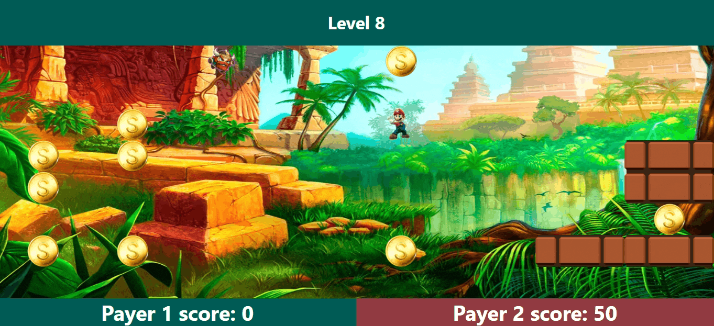

[![Contributors][contributors-shield]][contributors-url]


<!-- PROJECT LOGO -->
<br />
<p align="center">
  <a href="https://github.com/tomeraitz/gold-rush-client">
    
  </a>

  <h3 align="center">Gold Rush Client</h3>

  <p align="center">
  A Game Gold Rush - this repo is the client-side with react.
    <br />
    <br />
    <br />
    <a href="https://gold-rush.netlify.app/">View Demo</a>
    ·
    <a href="https://github.com/tomeraitz/gold-rush-client/issues">Report Bug</a>
  </p>
</p>


<!-- TABLE OF CONTENTS -->
<details open="open">
  <summary><h2 style="display: inline-block">Content</h2></summary>
  <ol>
    <li>
      <a href="#about-the-project">About The Project</a>
      <ul>
        <li><a href="#built-with">Built With</a></li>
      </ul>
    </li>
    <li>
      <a href="#getting-started">Getting Started</a>
      <ul>
        <li><a href="#installation">Installation</a></li>
      </ul>
    </li>
    <li><a href="#File">File Hierarchy</a></li>
    <li><a href="#acknowledgements">Acknowledgements</a></li>
  </ol>
</details>


<!-- ABOUT THE PROJECT -->
## About The Project


This Repository is client-side, here we can find the UI behavior.

### Built With

* [React](https://reactjs.org/)
* [socket.io-client](https://www.npmjs.com/package/socket.io-client)
* [axios](https://www.npmjs.com/package/axios)
* [eslint](https://eslint.org/)

## Getting Started
To get a local copy up and running follow these simple steps.


### Installation

1. Clone the repo
   ```sh
   git clone https://github.com/tomeraitz/gold-rush-client.git
   ```
2. Install NPM packages
   ```sh
   npm install
   ```
3. Run It on localhost with client repository(3000) with server localhost(8000)
    ```sh
   npm run start:dev 
   ```

4. Run It on localhost with client repository(3000) with production server
    ```sh
   npm start 
   ```

<!-- USAGE EXAMPLES -->
<h3 id="File">File Hierarchy</h3>

**src**
-  **assets**
    - **images**  - all the client images.
-  **components**
    - **Containers** - I used the Presentational and Container pattern for this project.
        - App - The main component that rendered in the beginning.
        - ButtonPhoneController - PC and mobile are different, in pc you move with the keyboard, in mobile you move with buttons, this component control those buttons.
        - Game - Control the game UI
        - Loading - The loading page.
        - PopupContainer - control on all the game popups.
    - **Hooks** - custom hooks.
        - useGameState - Control on the data of the game.
        - useHttpsRequests - Control all the client requests for a website (not websocket).
    - **Presentational** - All the simple components.
    - **helpers** - React embed scripts (reportWebVitals.js and setupTests.js).
## Acknowledgements

* The project live at [Netlify](https://www.netlify.com/)
* The Read me file was created with the template [Best-README-Template](https://github.com/othneildrew/Best-README-Template)

[contributors-shield]: https://img.shields.io/github/contributors/tomeraitz/gold-rush-client?color=green&style=for-the-badge
[contributors-url]: https://github.com/tomeraitz/gold-rush-client/graphs/contributors
